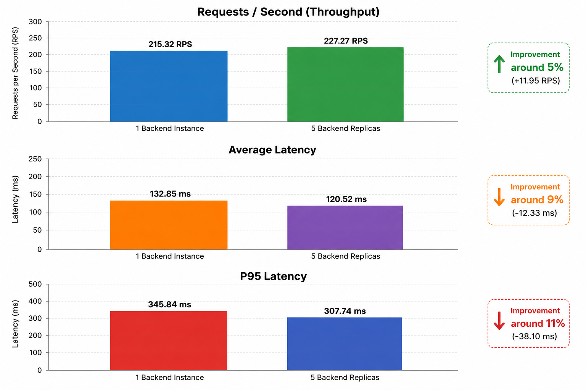

# DOMAIN Task of DEVOPS SPIDER

## 1. Approach
Instead of serving the frontend via go backend, as the task mentioned I have craeted separate docker files for frontend and backend. hence when the docker compose is excuted it spins up three containers. One for postgress one for frontend and one for backend

Since the frotend and backend are served individually, the scaling is easier as i can easily spin up many frontend container if many people views the timetable, since not many will edit it,

And also nginx is used which will cache the response received, hence if a user visits site 10 times a day to see time table, it will not cause strain to db and backend all teh 10 times, although we can later use cloudfare cdn for the nginx.

## Challenges faced
For some reason, there was problem in the environment variables setup during the postgress download, since i was new to the mac setup.

I changed the default password for the pgadmin, yeah but soon realised to fix it.

## major error
Initially in docker compose, i passed the password in the connection string in the environment variable as classrep123, but when i changed it, got me issues, which i found the solution as postgress do not load configuration after it has loaded for the first time, hence either
1. Use the alter command
2. down the volumes and again up or docker compose command 

Since the local postgress was already running on local mac on the port 5432, hence got the issue of PORT ALREADY IN USE, to fix this issue permanently, chnaged the exposed port to 5433 which will be mapped to 5432 runnign inside teh container


## Frontend Problems and Fixes
**Errors SPA Routing:**
Since the frotend is made from react, which uses spa(single page architecture) there are some problems with it for example if user requests /anshul route, nginx looks for anshul.html and gives 404 error , to fix this we need it to redirect it to index.html so that react handles it properly.  
The fix try_files $uri $uri/ /index.html is written in nginx.conf so that it redirects it back to index.html


**Reverse Proxy:**
Since the backend is also running within a docker container, nginx can act as a middle man between frontend and backend containers, that is if /api , we passs the request to the backend, else frotend ,hence now we dont separate domain name for frotend and backend we can have , hello.com for frotend and hello.com/api for backend and can have ssl on nginx making both the traffic https just by having certificate on nginx

**Header Issues:**
Since we use nginx to serve our backend request, and use nginx as middleman, backend will see every request coming from nginx, hence if someone tries ddos on our backend, it always sees that request coming from nginx, hence we need to fix it, hence the following configurations are made in nginx.conf

        proxy_set_header Host $host;
        proxy_set_header X-Real-IP $remote_addr;
        proxy_set_header X-Forwarded-For $proxy_add_x_forwarded_for;


## Backend Problems and Fixes
**Database takign time to load:**
For this problem, we can also wait for the database in the golang code, but instead docker's default way can be used that is considering the database not working as failure, we retsart the backend on every failure, bu adding restart: on-failure on docker compose.

**Exposing Ports:**
The issue is with the postgress port because this is highly likely that people alrady have postgrss running on their system port 5432 hence it will giver errir PORT ALREADY IN USE. So intead we map the port of 5433 to teh container port of 5432


## You should also explore at least one misconfiguration case and understand why it fails. 

### broken security/proxy headers

1. If header are broken in the nginx.conf. By default the go backend will receive the request from the nginx since we have used reverse proxy, hence even if any attacker lets say do DDOS attack the backend will see the request coming from the nginx hence even if we have the rate limiter setup it wont work, since we dont want to block api request from our frotend, hence vertain headers needs to be perfectly used in the nginx.conf.

2. If any hacker exploits the system we can never track him since in the logs we will receive ip of the our frontend container.


## How to run
A single docker compose command can run the entire application and it will be available on the port 5173

docker compose up -d --build

build is perfect since it will build the image from scratch keeping in mind if there is any chnage in the code. 
d helps use terminal while the container is running


## 3. Services and Ports Used
Frontend (service name is frontend): Runs on port 5173
Backend (service name is backend): Runs on port 8080. 
Database (service name is db): Runs internally on port 5432 (mapped it to 5433 on your machine to avoid local port conflicts).

## 4. How the Frontend Reaches the Backend
Frontend reaches the backend via reverse proxy. It is setup as the /api redirects the requests to the backend at port 8080, although it runs in other container but is served by the frotend conatiner nginx itslef.

## 5. How the postgress is configured
1. Postgress is running in the container and is invoked as the service named as db in the docker compose,

2. It uses the postgress alpine, which is lightweight instead of ubuntu which is a default image 

3. in the docker compose i have given default user and password, which we then use in the database connection string in the backend service and pass it as the environment variable directly.

## Migration
Migrations are already setup in the backend service, like whenever container starts it injects the data into it 

## Common failure cases and how to debug them
No any big failures, but one should configure passwords in the docker compose as the initial password for the db and teh passwords in the environment variable for backend service should match

# TASK-2 of DEVOPS DMOMAIN
## PART 1
### 1. Reverse Proxy with Nginx and HTTPS
Used nginx as a service running on top of frontend and backend, serving frontent at / and backend at /api, The traffic to the container goes through nginx itself, which then makes it easy to have ssl cetificae load balancing at one place itself.
used try_files in the conf of the nginx file to handle routing, since react injects the html into the root div, for every page, it doesnt have html file of the pages like about.html, in that case this is setup to serve index,html ehere then react handle the routing automatically by injecting the dom of certain page dependin gon thr route.

The, Any request starting with /api gets forwarded to the Go backend_pool, which is again a load balancer setup to distrubute the incoming traffic evenly amon the 5 services or conatiners running. The browser never talks to the backend directly, nginx becomes the man which does this translation hence its called reverse proxy

### 2. Enforcing https via ngin.conf
the self signed certificate via open ssl is used to have a https connection route between internet and nginx, as in after nginx the communication happens in the http way.
HTTPS is helpful is helpful since nginx wont send any harmful attack on its own backend and frontend hence https is set between internet and nginx which make connection secure as unlike http. in https, data is encrypted.


Also used mkcert to create locally trusted certificates so the browser shows that lock thing of secure connection, as some browser do not support self signed certificates.

### 3. Managing CORS issue
The cors policy that i have used is to allows every request from the http://localhost via `Access-Control-Allow-Origin` , which means that no any other domain will be able to access the backend. Once its deployed we can replace it with the domain name. Then specified the type of request allowed, which is default like GET, POST, one can omit for example patch

Some requests require permission before the browser sends the real request. for example 
WILL YOU ALLOW REQUESTS WITH THESE HEADERS,since soem browsers allow request with certain headers only, hence option is used, this might not be relevant for this task.


### 4. GZIP
Gzip is used to compress the response from the backend to the frontend. Since it is used for compression, it makes no sense to use ot for small data, like /health endpoint, hence we dont compress it as it takes even longer time to srve it for the users. hence compression done for files or response greater than 1 kb only.


## PART 2 JENKINS
The CI video is shown below


[LIVE CI](https://drive.google.com/file/d/17S1Rn6QqUY1OQ8Ig3NjxT48JskBbttaq/view?usp=sharing)

> [!NOTE]
> Since github webhooks requires a public url not localhost one, so i have used ngrok to generate a public url.

## PART 3 Production Optimisations


### 1 Upgraded the docker file 
Used multi stage build concept in the docker
Used alpine images
For the golang backend, the binary is saved, all the go libraries are just used to craete the binary. hence the size of backend image is 10 mb.

### 2 NGINX PERFORMANCE TUNING
Used gzip not only css and html files but also all kind of media such as images, although its not relevant since no imaeg is in the project

### 3 CI CD PIPELINE
Instead of using docker ceds directly I have used the environment variables hence the jenkins file can be safely exposed to github
Linter tests on the backend

### Resilience
Configuered auto restart in failure of any container or service in the docker compose


### BROWNies
## PART 4: Load Balancing and Failover Strategy
[Full test video](https://drive.google.com/file/d/1rFZt9RVl0FJ2Nvkf0hz3H_b1WR7ougmG/view?usp=sharing)

when any container is stopped , nginx automatically serves the running container hence i got one ip at ther terminal after killling a conatiner, but next time i run the command all the containers were up and running
> [!NOTE]
> i updated the /healthz endpoint from /healthz to /api/healthz and also it returns ip of the containers that is being served with the traffic

### 1. Load Balancing Setup
We run 5 backend replicas in Docker Compose (`backend-1`, `backend-2`,`backend-3`,`backend-4`,`backend-5`). 
Nginx is configured to load balance traffic between these backend instances. 
Inside nginx.conf, we defined an upstream block:
```
upstream backend_pool {
    server backend-1:8080;
    server backend-2:8080;
    server backend-3:8080;
    server backend-4:8080;
    server backend-5:8080;
}
```
Nginx forwards incoming requests to each backend instance one by one.

### 2. Failover Strategy
Inside Nginx, I configured the proxy_next_upstream directive:
```
proxy_next_upstream error timeout http_502 http_503;
```
If a backend instance goes down, Nginx automatically forwards the request to the next healthy instance. The user does not see any error, and the application remains fully available.
---
### 3. To Verify Traffic Distribution (Logs & Output)
To test that Nginx is balancing requests between all replicas, we make 10 requests to `/api/healthz`. Each backend replica returns its container IP address.
**Command to run:**
```bash
for i in {1..10}; do curl -k -s https://localhost/api/healthz | grep -o '"ip":"[^"]*"'; done
```
**Output showing round-robin distribution across all 5 replicas:**

"ip":"172.18.0.4"   (backend-1)
"ip":"172.18.0.6"   (backend-2)
"ip":"172.18.0.8"   (backend-3)
"ip":"172.18.0.3"   (backend-4)
"ip":"172.18.0.5"   (backend-5)
"ip":"172.18.0.4"   (backend-1)
"ip":"172.18.0.6"   (backend-2)
"ip":"172.18.0.8"   (backend-3)
"ip":"172.18.0.3"   (backend-4)
"ip":"172.18.0.5"   (backend-5)

### 4. How to Verify Failure Recovery (Failover)
To prove that the application survives when a backend instance is stopped, we stop the first instance backend-1.

**Testing requests distribution again (10 requests):**
```bash
for i in {1..10}; do curl -k -s https://localhost/api/healthz | grep -o '"ip":"[^"]*"'; done
```
**Output showing that backend-1 (IP 172.18.0.4) is skipped, but the application is 100% available and traffic is distributed to the other 4 backends:**

"ip":"172.18.0.5"   (backend-5)
"ip":"172.18.0.6"   (backend-2)
"ip":"172.18.0.8"   (backend-3)
"ip":"172.18.0.3"   (backend-4)
"ip":"172.18.0.5"   (backend-5)
"ip":"172.18.0.6"   (backend-2)
"ip":"172.18.0.8"   (backend-3)
"ip":"172.18.0.3"   (backend-4)
"ip":"172.18.0.5"   (backend-5)
"ip":"172.18.0.6"   (backend-2)


## PART 5: Performance Testing & Analysis
[Full test video](https://drive.google.com/file/d/1HdzGejp2903MtW0dx5y94GEnd9LR-Ccx/view?usp=sharing)


Evaluate the performance characteristics of the deployment under different configurations, comparing a single-backend instance to a multi-replica load-balanced deployment.

### 1. Load Testing Setup
- Used K6
- `/api/stress` was the new endpoint created which to make cpu work, its a infinite loop running till 10 to poer 8 second
- By k6, 100 active users hitting the endpoint within 10 seconds
- **Configurations Tested**:
  1. **Single conatiner Instance**: 1 standalone Go backend instance without container replication.
  2. **Multi-container Deployment**: 5 Go backend replicas running in Docker Compose using nginx

---

### 2.Results

Below is the performance comparison between the two deployment configurations under the 100 VU test profile:

| Metric | 1 Backend Instance | 5 Backend Replicas | Improvement / Delta |
| :--- | :---: | :---: | :---: |
| **Requests / Second (Throughput)** | 215.32 RPS | 227.27 RPS | **around 5%** |
| **Average Latency** | 132.85 ms | 120.52 ms | **around 9% lower** |
| **P95 Latency** | 345.84 ms | 307.74 ms | **around 11% lower** |

---

### 3. Performance Analysis & Comparison

Horizontal scaling did improve the overall performance, though the gains under this specific load profile are modest:
- **Throughput**: Increased from **215.3 RPS** to **227.3 RPS** (approx. +5.6%).
- **Latency**: The average response time dropped by **9.3%** (from 132.9 ms to 120.5 ms), and higher-percentile latencies (P90 and P95) also saw an 8% to 11% improvement.
- **Reliability**: There were no failures since the load was not that high and users were less as far as my local system is concerned

---

### 4. Concurrency Levels and Scaling

The point is since all the containers use my local system itself, there is only small increment, 

---

### 5. Potential Bottlenecks

1. **Host Hardware Constraints**:
   All containers (Nginx, Go backends, Frontend, and Database) are run on the same my same local machine. They share the same resources. Therefore, increasing the replica count doesnt inrease my hardware capablities instead they share the resources
2. **Database Concurrency**:
   [Potential Bottleneck but again not relevant since for load testing the /api/stress has no database call]Since i ahev only one db running of postgress, it doesnt matter how many backend instrance i craete, but in production all instances will share the same single db instance
3. **Backend Efficiency**:
   Since the backend is written in go, it is fast and hence 100 calls that too nothing to do with the db , doesnt make much of the differnece even if i use multiple backend replicas





